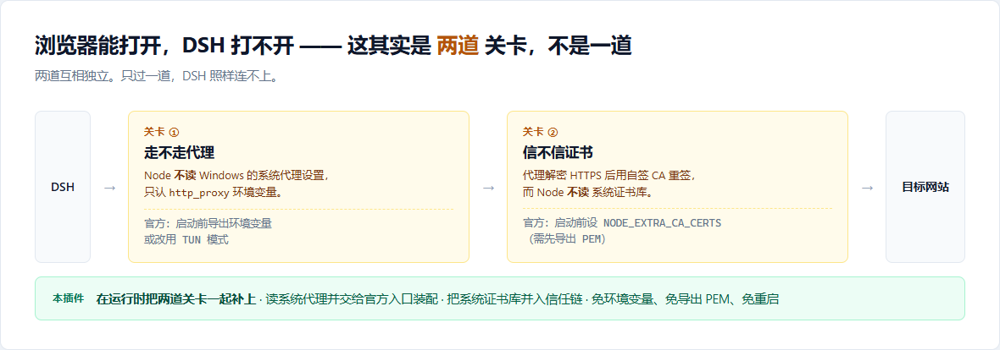
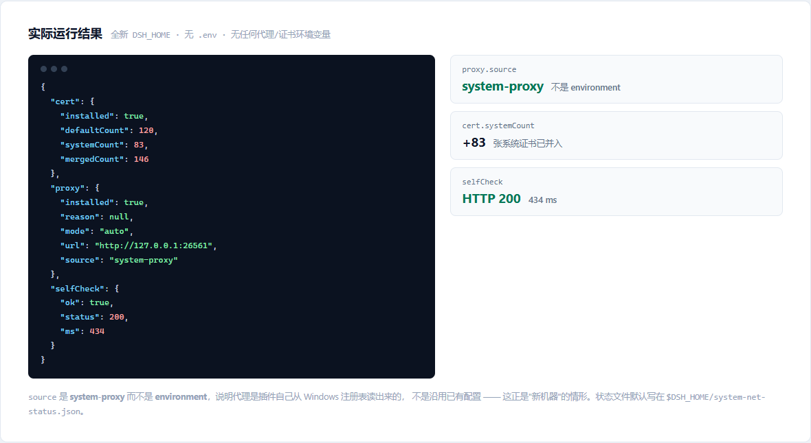

<p align="center">
  
</p>

<h1 align="center">dsh-system-net</h1>

<p align="center"><b>让 DeepSeek Harness 跟随系统网络设置：走系统代理，也信任系统证书库。<br>加速器开着、浏览器一切正常、DSH 却连不上网时，装它。</b></p>

<p align="center">免配环境变量 · 免导出证书 · 免重启</p>

<p align="center">
  <a href="README.md">English</a> ·
  <a href="#安装">安装</a> ·
  <a href="#使用条件重要先看这段">使用条件</a> ·
  <a href="#验证是否生效">验证</a> ·
  <a href="#配置">配置</a>
</p>

<p align="center">
  
  
  
  
</p>

---

## 安装

```sh
dsh plugin --profile web add dsh-system-net
```

没有全局 `dsh` 命令的话：

```sh
npx -y @deepseek-ai/dsh plugin --profile web add dsh-system-net
```

装完**重启一次 DSH**。插件在加载时生效；此后每次启动都会自动重新检测，**不需要任何后续维护**。

> **要求**：Node **22.19+ 或 24.5+**，DSH **0.2.0-rc.2+**。
> 版本不符时插件**不会崩**——它会把具体原因写进状态文件，并告诉你该改用哪种官方做法。

### 从 GitHub 直接安装

```sh
dsh plugin --profile web add github:chickmat/dsh-system-net
```

本插件是**纯 JavaScript、零构建步骤**，所以这条路可以直接用——不需要给 pnpm 授权运行 `prepare` 构建脚本（那等于**允许这个包的代码在你机器上执行**）。

### 卸载

```sh
dsh plugin --profile web remove dsh-system-net
```

**没有残留。** 所有改动只存在于进程内存里，重启即恢复 Node 默认行为。想把状态文件一起清掉，删 `$DSH_HOME/system-net-status.json` 即可。

## 为什么"浏览器能用，DSH 不能用"

这不是 DSH 的 bug，而是 Node 的两个默认行为。它们是**互相独立的两道关卡**：

| 关卡 | 原因 | 官方要求你怎么做 | 本插件怎么做 |
|---|---|---|---|
| **① 走不走** | Node **不读** Windows/macOS 的"系统代理"，只认 `http_proxy`/`https_proxy` 环境变量 | 启动前导出环境变量，或改用 TUN 模式 | 运行时读系统代理 / 探测本地端口，调用**官方入口**装配 |
| **② 信不信** | 代理解密 HTTPS 后用自签 CA 重签；Node **不读**系统证书库 | 启动前设 `NODE_EXTRA_CA_CERTS`（要先导出 PEM）或 `NODE_OPTIONS=--use-system-ca` | 运行时把系统证书库并入信任链 |

**只要其中一道没过，DSH 就用不了。** 本插件把两道都补上，所以不用你手工配任何东西。

### 怎么看自己卡在哪一道

| DSH 里的报错 | 卡在 |
|---|---|
| 超时 / `ECONNREFUSED` / `ENOTFOUND` / 一直转圈 | ① 走不走 |
| `UNABLE_TO_VERIFY_LEAF_SIGNATURE`<br>`unable to verify the first certificate` | ② 信不信 |

两者都会在装好本插件后一并解决。

## 验证是否生效

插件会写一份状态文件到 `$DSH_HOME/system-net-status.json`（默认 `~/.dsh/system-net-status.json`）：

<p align="center">
  
</p>

- `proxy.source` —— 代理从哪来：`system-proxy`（读系统设置）/ `port-probe`（探测端口）/ `environment`（环境已配好，插件未介入）/ `manual` / `not-found`
- `cert.systemCount` —— 从系统证书库读到多少张（`0` 说明平台不支持或库为空）
- `selfCheck` —— 加载时做的一次真实请求。**最有说服力的一项：它是 200，说明整条链路真的通了**

上图那次运行的环境是：**全新的 `DSH_HOME`、没有 `.env`、没有任何代理或证书环境变量**——也就是一台"新机器"。`source` 是 `system-proxy` 而不是 `environment`，说明代理是插件自己从 Windows 注册表读出来的。

## 使用条件（重要，先看这段）

**本插件只适用于「系统代理」模式的加速器**——也就是会在 Windows「Internet 选项 → 连接 → 局域网设置」里写下代理地址的那一类。

| 加速方式 | 代表软件 | 本插件 |
|---|---|---|
| **系统代理 + 自签证书（TLS 拦截）** | **Watt Toolkit（Steam++）、dev-sidecar** | ✅ **正是为它写的** |
| hosts / 本地 DNS 改写 + 本地反代 | FastGithub、UsbEAm Hosts Editor、SwitchHosts | ❌ 它们不写系统代理，读不到 |
| TUN 虚拟网卡 | Clash / v2ray 的 TUN、多数游戏加速器 | ⭕ **不需要**（全透明，官方也推荐这个） |
| Web 型反代（改写 URL） | gh-proxy、ghfast.top | ⭕ 无关（不是本地代理） |

### 另外两个前提

1. **加速器要先开好，再启动 DSH。** 插件在 DSH 启动时检测一次。顺序反了也不怕——插件默认**每 10 秒重试一次**（`watchProxy`），检测到就自动补上。
2. **系统代理只有一个全局槽位。** dev-sidecar 的文档就明确要求"与 Watt Toolkit 共用时请以 hosts 模式启动 Watt Toolkit"。两个软件都开系统代理会互相抢，本插件也救不了。

### 条件不满足时，它会明确告诉你

绝不静默失败。原因会写进状态文件，并在日志里给出可照做的提醒：

| 检测到的情形 | `proxy.source` | 提醒内容 |
|---|---|---|
| 系统代理正常 | `system-proxy` | — |
| **PAC 自动配置** | `pac-unsupported` | 本插件不解析 PAC，请改用「系统代理」模式 |
| 代理地址无法解析 | `unparsable` | 请检查加速器设置，或用 `proxyMode: manual` |
| 什么都没检测到 | `not-found` | 逐条列出：① 加速器要先开 ② 是否系统代理模式 ③ 改用手动模式 |

## 它和别的代理插件有什么不同

市面上有十来个 DSH 代理插件，但它们的做法大多是**直接替换 undici 的全局 dispatcher**。这样做有个隐蔽的漏洞：

> `dsh-web-fetch-http`（也就是 `web_fetch` / `web_search` 的底层）并不看全局 dispatcher，它调用官方 `@deepseek-ai/dsh-http-proxy` 的 `proxyRouteFor(url)` 来单独决定路由。**只换 dispatcher 的插件，会让 `web_fetch` 绕过代理直连。**

本插件不自己造轮子，而是调用官方提供的**运行时入口** `installProxyFromEnvironment()`。看它的实现就明白了：

```js
installGlobalProxy(policy) {
  applyPolicyEnv(policy);       // ① 写进 process.env → git / curl / npm 等子进程一并受益
  setGlobalDispatcher(agent);   // ② 全局 dispatcher → 模型请求、MCP 生效
  active = policy;              // ③ 更新策略 → proxyRouteFor() 跟着变
}                               //    → web_fetch / web_search 也正确走代理 ✅
```

第 ③ 步是关键。走官方入口，路由策略与 dispatcher **永远一致**，也不会和其它插件抢同一个位置。

## 配置

在 profile 的 `cordis.patch.yml` 里覆盖：

```yaml
- id: system-net
  name: dsh-system-net
  config:
    proxyMode: auto
    noProxy: 'internal.example.com'
    extraCaFiles:
      - 'C:/certs/corporate-ca.pem'
```

### 代理

| 字段 | 默认 | 说明 |
|---|---|---|
| `proxyMode` | `auto` | `auto` 尊重已有环境 → 读系统代理 → 探测端口；`manual` 只用 `proxyUrl`；`off` 完全不碰代理 |
| `proxyUrl` | `''` | `manual` 模式的代理地址，如 `http://127.0.0.1:7890` |
| `probePorts` | 常见端口 | `auto` 模式探测的本地端口 |
| `probeTimeoutMs` | `600` | 每个端口的探测超时 |
| `watchProxy` | `true` | 首次没检测到代理时按间隔重试（救"先开 DSH 后开加速器"） |
| `watchIntervalMs` | `10000` | 重试间隔（毫秒） |
| `noProxy` | `''` | 追加的直连条目（逗号分隔）。loopback 由官方库无条件保证 |

### 证书

| 字段 | 默认 | 说明 |
|---|---|---|
| `includeSystem` | `true` | 并入操作系统证书库 |
| `includeDefault` | `true` | 保留 Node 自带的 Mozilla 根证书集（**建议保持开启**） |
| `extraCaFiles` | `[]` | 额外信任的 PEM 文件路径 |

### 公共

| 字段 | 默认 | 说明 |
|---|---|---|
| `enabled` | `true` | 总开关 |
| `statusFile` | `''` | 状态文件位置；空表示 `$DSH_HOME/system-net-status.json` |
| `selfCheck` | `true` | 加载后做一次真实请求 |
| `selfCheckUrl` | GitHub API | 自检目标 |
| `selfCheckTimeoutMs` | `15000` | 自检超时 |

## 兼容性

| 项目 | 要求 |
|---|---|
| Node | **22.19+ 或 24.5+**（`tls.setDefaultCACertificates` 的引入版本） |
| DSH | 0.2.0-rc.2（实测通过） |
| 平台 | 代理自动检测（读系统代理）**仅 Windows**；其他平台可用 `manual` 模式。证书部分全平台 |

Node 版本不符时插件**不会崩**：它会把明确原因写进状态文件，并提示改用 `NODE_EXTRA_CA_CERTS`。

> 注：Node 23.x **不在**支持范围内——它有 `getCACertificates`（23.10+）但没有 `setDefaultCACertificates`。

## 它不做的事

- **不使用 TUN 模式**。如果你的代理软件有 TUN（虚拟网卡）模式，开它即可同时解决两道关卡，不需要本插件。Watt Toolkit / Steam++ 这类只有系统代理的加速器才用得着。
- **不修改任何配置文件**。不写 `~/.dsh/.env`、不改注册表、不改系统环境变量。所有改动都在当前进程内存里，进程退出即消失。
- **不影响子进程的证书**。agent 在 shell 里跑的 `git`、`curl` 有自己的证书逻辑，本插件管不到。但代理环境变量**会**被子进程继承。
- **不解决代理本身的问题**。如果加速器没开、端口填错、或代理软件不支持你要访问的站点，本插件无能为力。

## 安全说明

**证书部分**：本插件信任的是你操作系统证书库里**已有的**根证书，等价于 Node 官方 `--use-system-ca` 的行为，不新增信任来源——**但它确实扩大了 DSH 的信任面**。因此：

- 如果机器上有你不认识的根证书，先查清楚再开；
- 想收紧：`includeSystem: false` + `extraCaFiles` 只信任你点名的那一张；
- 卸载即恢复 Node 默认。

**代理部分**：插件读的是你系统里**已经生效**的代理设置，只是把它转达给 DSH，不会凭空指一个代理出去。状态文件里的 `proxy.url` 就是它实际用的地址，可自行核对。

**网络行为**：插件在**每次 DSH 启动时发一个 HTTPS GET** 做自检（默认 `api.github.com/rate_limit`）。它不发送任何本地数据，只用于证明"整条链路真的通了"；不需要的话设 `selfCheck: false` 即可关闭。

## 许可

MIT · 有 19 项单元测试，`npm test` 可跑。

⭐ 如果它解决了你的问题，给一个 star —— 这是其他开发者找到它的方式。
